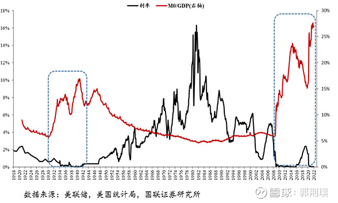
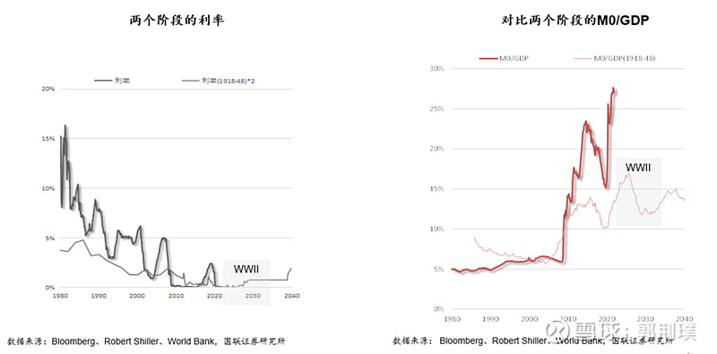
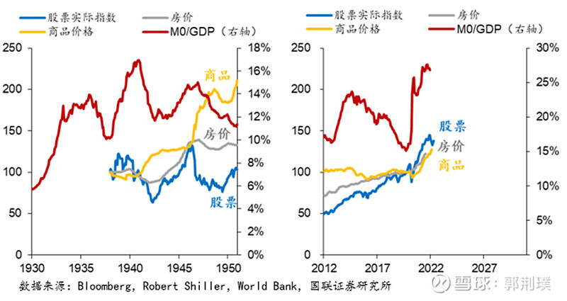

# 大萧条那从未被吸取的教训

来自[郭荆璞的雪球专栏](https://xueqiu.com/7571730629/column)

本文首发于《证券市场周刊》

> “我们要揭示的是，政府干预是如何造成 20 世纪 20 年代那场并不健康的繁荣，胡佛的全新方式是如何通过大量的干预手段使美国大萧条加剧的。经过漫长的时间，我们终于明白：大萧条的错误并不在于自由市场经济，而应当归咎于政客、官僚和那些’先进’的经济学家。而且，对过去和将来发生的任何一次萧条来说，情况都一样。”

—— 罗斯巴德《美国大萧条》，“总结：胡佛带给我们的教训”

**如何解释大萧条？这是伯南克眼中宏观经济学的圣杯。**

传统的解释框架将大萧条归因于胡佛的自由放任。

明斯基指出金融体系内在的不稳定性，来源于商业银行为代表的信用创造机构和贷款人的内在特性，金融机构的逐利行为是现代金融体系脆弱性的根源。部分学者将这种脆弱性与监管的失位联系起来看作是金融危机发生和发展的根源，而伯南克等人则深入分析金融危机与金融机构信用中介作用之间的相互作用，指出信用中介失效是导致大萧条后半程持续深化的主要原因。此外，美国主要产品价格出现回落、失业问题、信心的变化，以及国际政治经济环境，都成为解释大萧条的理论。这些理论的共同点在于，普遍认为胡佛政府在执政期间的不作为，对危机的反应迟钝，以及内里对自由放任的信仰，是导致大萧条成为历史上独一无二的长期、深度灾难的重要原因。

罗斯巴德在《美国大萧条》当中却提出了令很多读者（包括我）感到十分惊诧的观点：胡佛是罗斯福新政的先驱，他推行了几乎所有后来被归于罗斯福功绩的政策，唯一的不同是罗斯福的公共宣传更加成功。

从其表象来看，本书最重要的洞见，和奥地利学派一以贯之的观点是对凯恩斯主义，对政府干预的批判；这种批判立论的基础便是批驳对大萧条起因的解释，和对大萧条之后政策应对的批评。这种批判既构成了对解释大萧条的各种理论的辨析，也形成了对经济学思维方式的思考，即如何看待统计学的研究方式和思辨的价值。

**在《美国大萧条》一书中，罗斯巴德对大萧条的解释如下：**

A．20 年代，美联储对货币和银行体系信贷总量的控制导致了储蓄和投资不平衡；

B．30 年代，财政政策和对工资的干预性政策阻碍了微观的相对价格和工资调整，影响了资源和劳动的再分配。

本书的前半部分从理论和批判入手，建立了思考的框架，后半部分则以年为单位叙述信贷扩张和干预性政策的恶果如何一步一步的制造了大萧条。本书的后半部分更容易阅读，然而前半部分描述的事实，特别是 20 年代美联储、美国政府的货币政策和引导信贷扩张的策略，才是大萧条真正的原因。

在本书的末尾，罗斯巴德将读者的思绪引申到奥地利学派最深层次的恐惧 —— 对计划经济取代市场经济的恐惧，以及对危及财产权的政府力量的恐惧。这本书既是对解释美国大萧条的经济学的努力，也是奥地利学派最重要的思想总结和文献之一。

一切的一切，都来自于经济学家们从未真正理解的，也是政府和政策制定者们从未吸取的来自于胡佛的真正教训。

## 一、大萧条的根源 —— 政府为发展经济推动的货币和信贷扩张

> “政府是社会中唯一有权力进行伪造活动 —— 制造新货币的机构。”

—— 罗斯巴德《美国大萧条》第三版序言，1975.5

罗斯巴德在书中把大萧条指向了过度扩张的货币和信贷，然而他指出，这种过度扩张的根源不是自由放任，而是政府行为和力量。

罗斯巴德总结了奥地利学派的货币和商业周期理论，同时比较了主流的三种货币与周期理论：欧文 · 费雪的货币数量论、凯恩斯理论，和熊彼特的市场创新与企业家精神推动的周期论，以奥地利学派的框架对多种商业周期理论加以辨析，无疑他对信贷周期及其影响的解释是非常深刻的。此外，他还介绍了生产过剩 / 消费不足 / 投资不足 / 银行学派等多种解释大萧条的理论，并一一加以批判。

### 1. 危机的根源必须向危机前寻找，大萧条的根源不在 1929

罗斯巴德在本书中花了许多笔墨，分析和刻画胡佛总统，以及 20 年代柯立芝繁荣当中美国财政部、美联储、纽约储备银行的关键人物，他们登上权力宝座的脚步，深刻的影响了他们面对经济发展和市场变化时的抉择，从而影响力美国和全球经济走向 1929 年大萧条的过程，进而影响了整个 20 世纪的人类。

首先是赫伯特 ∙ 胡佛，这位被看作是自由放任导致大萧条的魁首，然而 20 年代美国政府一直在计划、干预、安排、刺激经济，胡佛正是作为一战中的经济官员起家的，他是天生的计划者、干涉者、安排者和激励者。

胡佛登上政治舞台的关键时期是 1921 年经济危机期间，1920 年代初期，胡佛的干预主义政策和信念逐步形成。对于胡佛来说，1921 年的经济危机是一次测试，表面上的自由放任政策与内里的强制 “自愿”，使胡佛坚定了遭遇 29 年经济危机时的干预政策。

胡佛在 1920-21 年的动作有：

1. 首先集中精力于失业问题，包括总统关于失业问题的协商会议，也曾有经济学家提出联邦劳动储备委员会，一系列会议形成了干预主义的共识；
1. 刺激住宅建设，促使银行为出口提供资金，并形成了对萧条的干预的先例；
1. 建立 3 家政府研究机构，研究成果包括《公共事业的计划和管理》、《商业周期和失业》等，并与美国劳工立法协会（American Association for Labor Legislation, AALL）等机构有效互动；
1. 在立法领域提交凯尼恩提案（解决失业问题，以及公共建设稳定计划，未通过）、齐尔曼提案（未通过）；
1. 以商业周期和失业问题的报告提交国会，成为 1929 年大萧条当中公共建设计划的依据。

以稳定物价、保障就业和工资率、抑制萧条为目标，以公共建设和货币性通货膨胀为手段，这是胡佛干预主义和 “罗斯福新政” 的共同本质。罗斯巴德用大量事实来说明，胡佛的自由主义是一种假象，如果商人不能按照政府意愿行事，接踵而来的将是强制性的管制。

直到 1929 年，国家经济研究局和胡佛领导的经济变动委员会都没有发现萧条即将到来。胡佛致力于利用 “科学” 的武器，将商业周期置于政府管理之下，这包括 20 年代以商务部名义帮助各行业协会建立的规范，在联邦贸易委员会的支持下，以 “减少不公平贸易” 为理由对竞争的阻碍。胡佛试图以政治原则和统计和经济学来管理商业周期。

另一位关键人物是纽约联邦储备银行总裁本杰明 · 斯特朗 Benjamin Strong，斯特朗在政策制定、执行，以及与英格兰银行和德意志银行的合作和博弈中都居于中心地位，超过了当时刚刚成立 10 余年的美联储的任何一位官员。纽约储备银行是 20 年代通货膨胀和低利率信贷的主要策划者，而不是美联储，特别是在汇票上面，纽约储备银行购买国外票据以支持别国货币并阻止黄金流入，这些外国商业汇票被按比例分配给其他储备银行。

整个 1930 年代，纽约联储在国际金融市场仍然扮演着美国中央银行的角色，包括与其他央行的磋商，向外国提供贷款，以及加入国际清算银行 (BIS) 等。

如果我们以 1920 年代对比 1980 年代，里根的新自由主义同样是伪装在削减税收旗号下的 MMT（巨额赤字没有改善），美联储遭到政治压力时总会选择将债务货币化，而债务货币化的隐秘结果之一是政府开支挤占私营投资的空间并耗尽私人储蓄。在干预劳动力市场上，政府也总是表现的过于积极。

### 2. 罗斯巴德对大萧条成因的总结和批判

奥地利学派认为，20 年代的持续信贷扩张导致的过度繁荣必然导致衰退，而从延续胡佛到罗斯福的干预政策则延长和深化了危机，政府本应顺应市场调整来迅速解决危机。

在奥地利学派的基本假设中，时间偏好决定消费还是投资（现在花钱还是将来花钱），货币效用决定持有现金的余额。在这个意义上储蓄和投资确实是一回事，储蓄既是以现金形式实现的投资，也是在为未来的投资准备资金（而不是为了未来的消费）。

现金余额增加意味着货币需求增加，因此也就会导致货币供应量的增加。罗斯巴德认为货币价值增加（通货紧缩）会导致实际现金余额的增加而不涉及任何分配，因此不会加剧萧条。

奥地利学派不承认流动性陷阱，他们认为流动性偏好不会影响利率，因为流动性偏好是短暂的，是即期的，不会影响长期的时间偏好，而时间偏好决定利率。因此萧条时期私人囤积的现金，不过是等待资本品价格下调，利润率上升从而重获投资机会的 “投机性” 的投资资金。

**奥地利通过思辨的方法，将萧条和危机的原因指向了 1920 年代的繁荣和信贷扩张，这是本书的核心理念。**

后世基于数据和统计的分析结论是，股市下跌和恐慌是大萧条的导火索，然而罗斯巴德认为，股灾对于大萧条来说只是一种表象，虽然 1929 年半个月间 (10.24-11.13) 股市从 452 点下跌到 224 点，但这其实是 1928 年 12 月的股票指数位置（245 点）。股票崩盘是触发了潜藏的经济危机，而不是导致了危机。

对大萧条的解释中，被广泛接受的是凯恩斯主义给出的自由市场导致了总需求不足，和货币主义者提出的 1929 年的紧缩政策导致金融体系崩溃。

#### 1）对凯恩斯主义的批判：

奥地利学派与凯恩斯主义争斗了半个世纪，罗斯巴德把凯恩斯主义总结为 “货币幻觉”，政府在凯恩斯的框架下，总是把维持名义工资水平作为主要的目标，但忽略了通货膨胀带来的实际工资下降。

在书中，罗斯巴德引用了哈耶克对凯恩斯的批判：

1. 简单假定零利润就足以维持资本；
1. 忽略生产各级领域；忽视各级生产领域的价格差异就是利息产生的原因；
1. 认为资本结构的更替是理所当然的；
1. 忽视资本价值的变化，忽视企业家与资本家各自的特点；
1. 没有认识到商人面临的问题，不是投资于生产消费品还是资本品，而是投资的资本品是否会在或远或近的将来产出消费品。

凯恩斯主义要求政府开支支撑总需求，其核心指向的是维持就业，甚至提出平分就业机会来减少失业人口总数。

罗斯巴德考虑的是，资本家支付给工人的工资总额才是真正的成本，因此工资率（工资总收入 / 工作总小时数）下降或者说单位小时工资下降有利于提升就业率。

资本品的生产不需要什么别的花费，而只需要工资、地租和利息，罗斯巴德把资本品所需的主要成本归结于这三项，例如石油开采的主要成本就是地租。在此框架下，劳动和土地是主要的竞争对手，工资率下降会导致经营者购买劳动替代土地，因为劳动比土地更有吸引力。因此劳动总需求会上升，劳动因工资率下降而更具弹性。

在罗斯巴德看来，解决大萧条的首要任务就是实际工资率的下降，在这一点上，奥地利学派与凯恩斯主义可以说是不共戴天。

#### 2）其他对萧条的错误解释：

##### A．生产过剩理论：

认为生产能力超出需求，或者没有足够的货币来实现消费，奥地利学派则认为是商人用过高的价格买入了生产成本，出现了成本和售价的倒挂，信贷扩张导致成本高于售价的不当投资，特别是对资本品的投资。

##### B．消费不足理论：

认为不公平的分配导致富人累积财富而无法消费同样比例，储蓄增加同样影响消费；奥地利学派则认为，储蓄增加是由于资本追加投资以维持经济发展过程中，不断扩大的维持和重置生产结构所需的资金需求。

奥地利学派对通货膨胀的看法，特别是实际工资率的看法是，信贷和货币扩张导致的通货膨胀事实上阻止了价格水平下跌，最终货币工资无法跑赢消费品通胀，导致了商业周期和灾难。

真正的经济灾难总是发生在资本品行业的。

发生在投资与消费之间的此起彼伏是自然的，能够同时扩张消费和投资的只有信贷的扩张。利率信号诱使企业家犯下一连串的错误。

##### C．投资不足理论：

认为繁荣期与投资机会充足相关，投资机会不足导致了萧条。投资机会与人口、资源、技术创新相关。然而投资总是无法满足现有技术组合所需的最大金额，因而技术并不是投资的上限；后进国家可以学习技术，但现在他们内部投资的储蓄不足，也是短期见效的投资会挤占长期的基础设施建设的问题。

投资机会永远存在，而且只受制于时间偏好和可获得的储蓄。

##### D．熊彼特商业周期：

熊彼特商业周期理论认为，创新成系列地发生于一些特定行业，造就了繁荣的产生，在平衡时利率是零，正利率意味着正收益。

熊彼特的创新既有偶然性又有周期性。在熊彼特看来，企业家通过创造新的机构来实现创新。

##### E． 性质信贷 - 银行学派：

信贷扩张进入错误的领域导致投机和通货膨胀，自偿性的短期信贷从实际商品销售中获得还款来源，不会引起通货膨胀。银行学派的代表人物是大通银行的本杰明 · 安德森 Dr. Benjamin M. Anderson，和哥伦比亚大学的帕克 · 威利斯 Dr. Parker Willis，他们的学说可能可以看做是明斯基的先辈。

银行学派的问题在于，即使是 “好的” 信贷，产生的货币一样会渗透于整个经济当中，控制信贷扩张的是利率，而不是用途。

股票是资本的价格，因而总是在繁荣中随着资本品的价格上涨而上涨。消费者分期贷款是面向消费者的贷款，只要不违规流入股市房市，就不会引起资本品的通货膨胀。

##### F． 贪婪与恐惧的心理作用：

贪婪与恐惧的心理：罗斯巴德争辩道，企业家总是可以根据掌握的信息做出理性预测而不是被心理左右，导致企业家犯下一连串错误的原因是，市场的客观事实被扭曲了，这种扭曲反映在信贷和利率中。

罗斯巴德虽然以大量篇幅描绘了 1929 年至 1932 年危机与萧条全程的全景图，但本书的核心理念在于，政府推动的信贷扩张是萧条的根本原因，其他一切的因素和解释在政府推动货币发行面前都黯然失色。

### 3. 20 年代的繁荣与致命的通货膨胀

罗斯巴德反对用历史统计的方式检验经济学理论，他坚持 “理论只能在先验的理论基础上被证实或证伪”。统计学分析的是众多诱因作用的结果，我们可以统计到利率下降，但我们并不知道利率与应该达到的水平有多大的差距。我们唯一能够确定的是利率下降是因为信贷扩张。

奥地利学派并不认为通货膨胀就是物价上涨，他们的看法是技术进步和生产扩大本应导致物价下跌，但货币性通货膨胀导致物价没有出现下降，这同样是通货膨胀，或者说，这是与通货膨胀一体的繁荣。

#### 1）大萧条前的货币供给研究：

货币是商品交换的一般媒介。任何可以按需转换为现金的要求权都可以算作是货币供应。

1921.7-1929.7，货币供给膨胀的年代。流通领域货币从 36.8 亿美元到 36.4 亿美元，几乎不变，通货膨胀完全发生在货币代替品上面，即信贷的扩张，而且大部分是私人贷款和投资。同期黄金储备增加了 16.6 亿美元（其中黄金准备金增加 4 亿美元，其余为未兑付金券的价值），而货币要求的总量（包括银行外通货、活期和定期存款、储蓄和贷款协会的股份资本、人寿保险退保责任等构成的货币供应总量，减去未偿还通货）则从 447 亿美元增加到 718 亿美元，几乎都是不可兑换为黄金的货币增长。

**通货膨胀的来源：** 商业银行系统的信贷扩张方式有三：准备金标准的降低、准备金总量的增加，和超额准备金的消耗。

##### A.    准备金标准的降低：

1921-1929 年，银行几乎没有超额准备金，准备金标准也未降低，不过由于活期存款需保证 10% 左右的准备金，定期存款则只需 3%，定期存款增长显著高于活期，是货币供应增长的重要原因。

货币供应总量从 453 亿美元增长到 733 亿美元（+280），其中存款从 378 亿美元增长到 552 亿美元（+174），活期存款增长 30.8%（+54），定期存款增长 72.3%（+120）。

定期存款的增长，得益于《联邦储备法案》，一方面该法案使国家银行向定期存款支付利息合法化，另一方面则降低定期存款的准备金标准（从 5% 降至 3%）。

##### B.    准备金总量的增加：

存款增长的 174 亿美元中，成员银行的存款增加了 108 亿美元（186 亿增长到 294 亿美元，占存款总量的 49.2% 增长到 53.2%），其中 20 亿美元来自准备金率下降（11.6:1 增长到 12.5:1，即准备金率从 8.6% 下降到 8.0%），而准备金总量带来的增长则达到 88 亿美元。

1921-29 年，成员银行准备金总量仅增长 7.6 亿美元，但推动了总量 280 亿美元的货币供应。

影响准备金总量的因素有：

不可控制因素：

1. 货币性黄金存量（+）
1. 银行外流通领域中的货币（\-）
1. 美联储的非成员银行存款（\-）
1. 票据偿还（\-）

美联储和政府可以控制的因素：

1. 美联储购买资产（+），包括买入票据和政府证券
1. 美联储的贴现票据（+）是可控上升因素，但偿还是不可控的下降因素
1. 其他美联储信贷
1. 待偿付的国库通货（+），主要形式是银券（可以 100% 兑换为银条和银元）
1. 国库库存现金（\-）
1. 美联储的国库存款（\-）
1. 美联储的未花费资本基金（\-）

可控制因素中，贴现票据、美联储买入的票据和政府证券，以及其他信贷构成美联储（准备金）信贷。在 1920 年代，这些是导致通货膨胀的主要因素。

20 世纪 20 年代准备金的四次扩张：分别发生于 22 年、24 年、27 年和 28 年 4 年的下半年，美联储信贷分别贡献了可控制准备金扩张的 65%、77%、100% 和 103%，其中：贴现票据主导 1922 年下半年（70%）；买入票据主导 1924 年下半年（78%）和 1928 年下半年（87%）；1927 年下半年的准备金扩张则由买入票据和政府证券共同主导（39% 和 40%），贴现票据贡献 25%；此外，政府证券在 1922 年下半年、贴现票据在 1924 年下半年有负贡献。贴现票据和买入资产是政府控制的主要的通货膨胀手段。

**贴现票据：**

贴现票据本应仅作为 “最后贷款人” 的手段来使用，并设置惩罚性利率，然而到 1921 年中期，三个权力中心（财政部、美联储、纽约联邦储备银行）均在罚息问题上妥协。而到了 1923 年，贴现票据被视为调控繁荣与萧条的手段，即以贴现票据来实现信贷扩张。

“信贷资源几乎将自动存在，并使利率低得足以刺激、保护和繁荣各种合法商业”——Harris, Twenty Years, p. 91

美联储在 20 年代末转向紧缩的时候犯了严重的错误，他们试图区分 “好的” 和 “不好的” 信贷扩张并仅对 “不好的” 信贷加息，然而货币市场的连通导致了加息和紧缩的效果蔓延到 “好的” 那些信贷，从而摧毁了经济。

这些 “好的” 和 “不好的” 信贷，最终都有很大比例流入了股市，推动了 1929 年股市最后的疯狂。最终的问题并不是贷款的性质（区别是虚幻的），而是贷款的总数量。

**买入票据（承兑汇票）：**

美联储最初以低于再贴现利率的利率价格买入承兑汇票，使买入票据成为主导前三次膨胀的主要因素。美联储在 29 年持有 46% 的承兑汇票（26% 国内美联储账户，20% 未代理外国央行的买入），美国的票据市场事实上是美联储坐庄的。

罗斯巴德把承兑汇票市场的发展归因于保罗 · 沃伯格 Paul Warburg 的私心。

美联储不仅购买国内的承兑汇票，也把购买英国和德国承兑汇票作为援助的一种方式。德国的承兑汇票与美国的区别在于，美国国内企业发行的承兑一般代表由特定卖家发送给买家的货物，而德国承兑则是未售出的库存，这包含了额外的风险。

通过承兑汇票方式流入德国的资金并没有帮助私营企业融资，而是流向政府，这是因为政府在争夺资源上有额外的优势；流向政府的资金最终又以战争赔款（德国）和偿还战争借贷（英国）的形式回流美国。

承兑汇票的风险是：利率过低和不透明。联储从承兑经纪商手中买入票据，但经纪商并不是美联储成员，执行交易的纽约银行可以不报告购买的种类、数量和交易对手，造成了风险膨胀且不可控。

**买入政府证券：**

美联储购买政府证券最初是为了持有获利，但产生的副作用（通货膨胀）使经济学家认为找到了长期保持繁荣的方法。

联邦债务市场的建立是为了滚动融资联邦政府短期债务。

除了贴现票据、购买资产这两种最主要的扩张信贷方式之外，待偿付国库通货的增加作为财政扩张的结果，也是信贷扩张的重要手段。

美联储信贷和其他可控的增加准备金的方式共同推动了 20 世纪 20 年代的货币供应量增长，而且是在全球央行的联手作用下，即便如此，到 1928 年末，这样的增长也变得不可持续了。

##### C.  超额准备金的消耗：

银行扩张信贷的第三种情况很好理解，即原来的超额准备金转变成信贷而消耗。数据显示 1929 年超额准备金大约只占准备金总额的 2%，因此罗斯巴德推断超额准备金的消耗，不是信贷扩张的主要原因。

#### 2）通货膨胀的进程和终结

20 世纪 20 年代的通货膨胀是全球性的，主要原因是美英法三国的货币政策互动。

概括来说是英国国内通货膨胀和工资率坚挺，英国威逼利诱法美力挺英国以稳定英国的出口和殖民地体系。随着德国的恢复，德意志银行也被纳入进来成为四方会谈，并最终导致了 1931 年德国货币市场和金融体系的崩溃。美联储特别是纽约储备银行在贴现票据市场和公开市场上的操作，配合了英格兰银行和英国政府，也支撑了美国农产品的出口，国际贸易和金融市场是英美通货膨胀政策的主要关注点。

##### A. 20 年代初期的美国通货膨胀

后世研究者关注的更多是美国。1921-22 年的大规模通货膨胀是由美联储购买政府证券引发的，并在贴现票据当中形成浪潮。其中重要的推手是农业，一方面是通过贴现向农业市场放贷，另一方面则是刺激向国外放贷（发行国外企业和政府的债券），从而刺激美国的农业出口。

这一轮的通货膨胀货币政策主要目标是摆脱经济萧条，刺激生产和商业活动，帮助农民，和扶持国外债券市场。

1923-24 年在经历了小规模萧条（主要是错误的关税壁垒导致的）之后，美国政府并没有降低关税，而是选择降低利率，试图通过刺激国外从美国借贷来拉动出口。美国关税壁垒的存在导致外国政府和企业无法通过缩小对美贸易逆差来还贷，只能持续借贷来借新还旧。

贸易保护 + 通货膨胀，受益者是工业企业（关税壁垒）、出口产业（资金扶持）、投资银行（发行佣金），受损的是美国民众（通货膨胀）。

##### B.  英国主导新的金本位造成的隐忧

如果我们更多地放眼全球，我们会注意到英国回归金本位和德国战争赔款在全球性通货膨胀以及之后的紧缩与萧条中，同样有着极其重要的影响。

英国问题的起因是，意欲恢复金本位，兑换率回归战前，造成英镑高估 10-20%，同时工会阻止工资率下降，导致黄金流出。美国为了援助英国在国内制造了通货膨胀，以减少黄金流入。

在这个过程中，美联储开始逐渐获得央行之央行的地位，试图干预并帮助英国、法国、德国、比利时等国恢复汇率和物价水平。

以国内通货膨胀为代价，美国阻止了黄金流入，这样美国的信贷为英国（占 40%，也包括其他国家）提供了长期资本。与此同时，英国应对黄金流出的措施在罗斯巴德看来是错误的，英国选择增加货币供应来抵消黄金流出。

在奥地利学派看来，黄金流入导致的货币乘数下降应当视为 “减少该国货币供给中伪造部分” 的时机，奥地利学派并不愿承认支持减少货币供应至等于黄金储备的主动措施。

20 世纪 20 年代，英国实行的是 “金块本位制”，即禁止使用金币，通货不能与黄金直接兑换从而禁止人们使用黄金作为交易媒介，将黄金兑换限制在大宗国际交易使用的金条上；美国实行的是真正的金本位制。

金块本位制是以黄金和其他国家更硬的通货作为储备货币的，为的是博取 “金本位制” 的好名声，这在 20 年代是有必要的，即表示从一战中完全恢复过来。

新的金本位制的基础是国际间中央银行的政治合作，其目的是共同推动信贷扩张，实现名义增长。20 年代主导这一新秩序的是英国，英格兰银行设计了新的金本位制并说服美国服从他们的领导，即使美国才是最大的黄金储备国。籍由新金本位制，英国实现了对欧洲大陆的出口增长，在满足商品成本上涨叠加超额的工会工资率的价格水平之上，掩盖了英国国内矛盾和殖民地的矛盾。

同时英国还利用自身的国际政治地位和经济领导力诱使或者迫使其他国家接受新金本位制，在全球通货膨胀中保持合作，维持了 20 年代的经济繁荣，以及英国的贸易顺差。

这种新金本位制的风险是过早的把资本输出的资金来源从自愿储蓄转向了不可兑现的银行信贷产生的货币派生，世界还没有做好准备。

二战后的 IMF 和 WB，曾经也类似于日内瓦的国际联盟财政委员会，通过重建和控制欧洲各国的货币体系来完成货币的分档，第一档是与黄金挂钩的英镑和美元，第二档是与英镑和美元挂钩的其他货币。布雷顿森林体系是一战后而不是二战后的产物。

是否可以说，1946 年经济危机的本质与 1929 年类似呢？或者与 1921 年经济危机类似？通货膨胀没有最终发展为巨大危机的原因是什么？是布雷顿森林体系更加完善？央行救援手段更及时？还是德国没有再次陷入赔偿泥潭？

##### C.  纽约储备银行在 20 年代的核心作用

1927 年下半年的准备金快速扩张是对英国救助的实际行动，期间买入票据和政府证券共同主导（39% 和 40%）了可控制的准备金扩张，贴现票据贡献 25%；主导 20 年代信用扩张的主要是纽约联邦储备银行总裁本杰明 · 斯特朗，他被英国视为坚定的盟友，在 1927 年他使用了各种手段来达到扩张准备金的目的。官方说辞是为了农业。

纽约储备银行是 20 年代通货膨胀和低利率信贷的主要策划者，而不是美联储，特别是在汇票上面，纽约储备银行购买国外票据以支持别国货币并阻止黄金流入，这些外国商业汇票被按比例分配给其他储备银行。

财政部在梅隆的领导下推波助澜，通过以低利率的准备金兑换券置换高利率自由债券的形式压低利率。

全球通货膨胀链条被打破与股票市场有很大关系，随着英镑一次又一次转入衰退，农业出口下降，资金向繁荣的美国股市流入，更多的货币创造不能继续支撑国外信贷，而当美联储最终决定对抗国内通货膨胀时，资金被提高的利率进一步吸引到美国，英美之间的资金循环终于崩塌了。

无论是英格兰银行，还是纽约储备银行，都无法阻止最终的大难临头各自飞。

法国政府在 1931 年对德奥关税同盟感到恐慌，以立刻兑付短期债务作为威胁，加剧了德国的财政和金融危机。英格兰银行则在放弃金本位之前的最后一刻仍然欺瞒主要的欧洲国家，诱使他们继续保留英镑作为国际储备。

1929 年 6 月通货和银行存款总额 36.4+551.7=588.1 亿美元，1930 年后期是 536 亿美元，下降并不多，1931 年 6 月下降到 529 亿美元，到 1931 年底已下降到 483 亿美元，货币供给总量也从 1929 年 6 月的 732 亿下降到 1931 年底的 682 亿美元。

1931 年美国大幅通货紧缩的原因主要是英国放弃金本位打击了公众的信心，流通领域的货币到 9 月底大量增加，导致成员银行准备金大幅下降（年初到 9 月底下降 1 亿美元），国外银行的破产进一步增加了恐慌情绪，到年底 3 个月内下降了 4 亿美元。从 1931 年 9 月开始，美国的货币性黄金存量增加的趋势也逆转了，从萧条初期到顶峰从 40 亿美元上升到 47 亿，然后到 31 年 12 月就下降到了 42 亿美元，到 32 年 7 月更下降到 36 亿美元。

国际金融市场的连锁反应最终导致了 1931 年德国金融危机，并成为希特勒上台最重要的推手，这是大萧条一系列后果当中最让人始料未及，也可能是人类在 20 世纪深重灾难中最让人扼腕的一例了。

#### 3）通货膨胀危机的最终爆发

1927 年最大膨胀之后，28 年上半年美联储试图收缩货币供应但失败了，原因有三：

1. 欧洲国家反对美国收缩，欧洲的问题源自自身的通货膨胀，因此美国的收缩是其不可承受的；
1. 大选年的政治压力；
1. 性质信贷学说的错误观念。

通货膨胀事实上结束于 1928 年底，之后的大半年，直到 10 月份股市崩溃，货币供应量上升不到 1%。7 月份资本品的泡沫就开始崩溃了，但被随后而来的股市大崩盘掩盖了。

从胡佛总统到参议员们再到美联储，很多人试图进行 “道德劝说”，通过区分贷款性质来实现对信贷流入股市的限制等等，但经济崩溃来自于信贷总量无法持续扩张，而不是用途出了问题。

29 年 8 月，联储提高了再贴现利率至 6%，却下调了承兑汇票利率，两相抵消，自相矛盾。7.29 到 10.23，买入票据增加 2.97 亿美元，抵消了贴现票据（2.41 亿美元）和政府证券（0.80 亿美元）的下降，并最终使成员银行准备金上升了 0.22 亿美元。

1932 年芝加哥会议上，经济学家戈特弗里德 · 冯 · 哈伯勒第一次向美国介绍了米塞斯的商业周期理论。

回顾奥地利学派对于通货膨胀和危机肇始的理解，我们可以看到何谓 “先验的” 经济学。首先是价格水平存在误导，奥地利学派先验理论的基础就在于此。价格水平理论不能区分由货币收缩造成的价格下跌，和由生产能力增加造成的成本下降。在大萧条之前，货币增加抵消了生产增长，批发物价保持不变，利息被人为压低，消费 - 投资的平衡被破坏，萧条是对延长的生产时间和不良投资，也就是过多的投向高级财货的资本的调整和清算。

生产资源错位要求资本和劳工转移，恢复消费 - 投资比例和低级 - 高级财货生产的平衡，进一步的通货膨胀措施会导致消费品和生产品之间的不平衡，就像危机前的宽松导致了消费者购买力的不正常增强和消费品需求不合比例的增加一样。

繁荣与萧条的循环来自于政府干预，前一半是因为政府推动信贷扩张带来的通货膨胀，后一半则是为了对抗萧条而推动信贷扩张并试图引发的通货膨胀，以及其他一切干预手段。

### 4. 稳定物价水平的诱惑破坏了货币的价值

奥地利学派对高工资率的看法是，高工资率是生产能力和资本投入扩大的结果，20 年代开始有经济学家提出高工作率是经济繁荣的原因。

稳定的物价水平来自两方面力量的博弈：

1. 银行信贷增加造成货币供应量增长；
1. 生产能力增加导致的生产成本下降。

这二者相互抵消。与此同时，消费品的生产成本下降，伴随着货币供应量增长导致的资本品价格上升，和生产资料所有权价格上升，消费品与资本品价格呈现不均衡的增长。

罗斯巴德整理了劳工统计局批发价格指数，数据显示：

（书中为 “1926 年为 100”，怀疑是 1920 年为 100）

1921.6      93.4  
1925.11    104.5  
1926.6      95.2

反映一般价格水平的斯奈德 Synder 指数：（包括房地产、股票、租金、工资率、批发价格等，1913 年为 100）

1922      158  
1929      179

资本品领域的通货膨胀则体现在：

1. 股票价格上涨 4 倍；
1. 耐用品和钢铁生产增加 160%，非耐用品生产增加 60%。同时资本品行业工资上涨速度超出消费品。

支持稳定物价（换言之诱导通货膨胀）的意见，重要的支撑是物价下跌将导致失业。奥地利学派批判的多位经济学家都赞同稳定物价水平。提出 “稳定货币” 并组织机构的是欧文 · 费雪，凯恩斯 1923 年的著作《货币改革论》中管理货币和稳定物价的思想，影响亦甚大。英国另一位鼓吹全球央行联合控制信贷以稳定物价的英国经济学家是拉尔夫 · 霍特雷。

1929 年 1 月，Allen A. Young 发表文章鼓吹通货膨胀，他对物价长期下跌趋势提出警告，主张中央银行不要囤积黄金，放弃过高的黄金准备金率，他说：“世界各国的中央银行看来都惧怕繁荣，只要他们还是这样，生产的增加就将被延缓。”

1929 年 4 月，口号进一步变成了 “投资美国”，任何对经济膨胀的批评都会被扣上不爱国甚至 “做空美国” 的帽子。

罗斯巴德等奥地利学派的学者坚持认为经济学是 “先验的” 学科，价格本身并不能说明通货膨胀或者紧缩，而应当由货币发行量来度量，罗斯巴德批评杨的地方就是在 1929 年将紧缩而不是膨胀视为主要的威胁。

通货膨胀和超量的货币在 1929 年已经是既成事实，因此在奥地利学派看来，大萧条是不可避免的，更是由美国、英国政府共同种下的恶果。

<!-- 本书最长的篇幅是在细致分析胡佛政府的政策，罗斯巴德给出了他最重要的判断 -->

## 二、胡佛与罗斯福真的有天壤之别吗？

> “剧烈而迅速地萧条可以清算先前的繁荣留下的不良投资，但是我们没有这么做。我们经历了一场迟迟不退的漫长衰退，它使我们受尽折磨，并使生产力和经济增长长时期处于停滞。”

—— 罗斯巴德《美国大萧条》第四版序言，1982.9

罗斯巴德在《美国大萧条》当中指出，胡佛推行的并不是自由放任，而是政府主导的通货膨胀和信贷扩张，1929 年大萧条的起因和急剧发展，以及其持久的破坏性结果，都是政府行为的结果，而不是自由资本主义的恶果。胡佛是罗斯福新政的先驱，他推行的主要政策形成了罗斯福新政的基础，胡佛失败而罗斯福成功的原因不是政策本身，而是罗斯福的公共宣传更加成功。

### 1. 政策的目标和手段

让我们来看一组政策：

1. 劝说雇主保持工资率；
1. 提高关税保护农业；
1. 信贷扩张维护金本位；
1. 住宅贷款银行系统为住宅贷款协会和储蓄银行提供长期资金；
1. 帮助债务人对抗取消抵押品赎回权；
1. 农业信贷银行向农民提供贷款；
1. 复兴银行公司银行、地方政府和公共建设提供贷款；
1. 平分工作以抑制失业；
1. 加强联邦土地银行。

然后是第二组：

1. 各工业企业制定本行业的公平经营规章，确定各企业的生产规模、价格水平、市场分配、工资标准和工作日时数等，以防止出现盲目竞争引起的生产过剩，从而加强了政府对资本主义工业生产的控制与调节；
1. 给减耕减产的农户发放经济补贴，提高并稳定农产品价格；
1. 大力兴建公共工程，以工代赈，增加就业刺激消费和生产；
1. 整顿银行与金融系，下令银行休业整顿，逐步恢复银行的信用。

这两组政策的核心，都是通过政府调控市场，通过规定产品价格、生产规模、信贷成本、就业和分配等方式，试图将就业率调整回归到萧条前的水平，其政策的内核和精神是类似的。

第一组政策来自于胡佛总统在 1932 年连任竞选中对自己 4 年施政的总结，而第二组则是 1933 年推出的罗斯福新政的主要举措。

我们可以再看一看 1932 年国情咨文中，胡佛对国会提出的施政建议：

1. 建立并加强复兴银行公司，用国库资金向银行、工业、农业信贷机构及地方政府提供贷款；
1. 放宽美联储对贴现申请的审批；
1. 建立住房贷款银行贴现系统，振兴建筑业并刺激就业；
1. 扩大政府对联邦土地银行的扶持；
1. 建立公共建设管理机构，协助和拓展联邦公共建设；
1. 为限制移民的政策争取法律支持；
1. . 减少自然资源利用中的破坏性竞争；
1. . 向各州提供 3 亿美元的直接贷款用于救济；
1. 修改相关破产法律，事实上减少对债权人的保护。

以稳定物价、保障就业和工资率、抑制萧条为目标，以公共建设和货币性通货膨胀为手段，这是 “新政” 的本质。胡佛和罗斯福是一脉相承的。保守主义称之为 “空想社会主义的尝试”，因为这些目标和手段都试图超越供给和需求之间的自然规律。

我们不要忘记，应对大萧条的标志性政策成果，科罗拉多河上的胡佛大坝，正是于 1930 年 7 月 3 日，获得国会授权拨款 9.15 亿美元，动工修建。胡佛在位 4 年的公共建设成绩比过去 30 年的总和更多，他劝说联邦和州政府实施了总计超过 15 亿美元的公共建设。

威廉 ·A· 贝里奇（William A. Berridge 都市人寿保险公司的经济学家）提出，公共建设使用公债会侵蚀投资基金的供给，资金被看似无风险实则无回报完全依赖政府信用的公共建设项目抽干，无法支持那些在萧条中试图抄底商业的投资项目和投资者。

概况而言，胡佛干预和罗斯福新政的要素是，通过拓展政府的经济计划和干预，达到反萧条的目的。

1. 直接或间接干预劳动力市场，包括补贴失业人口和公共建设等方式，抬高工资率和物价；（奥地利学派认为工资率和商品价格过高会导致就业不充分和消费不足）；增加政府开支是主要手段，其目的是对失业人口进行直接的经济补贴，以及为公共工程融资；
1. 设置关税壁垒，干预国际贸易；
1. 干预工业品和原材料市场，扶持濒临破产的企业；
1. 扩张信贷，干预金融市场。

胡佛的干预政策 “外柔内刚”，被很多经济学家和经济史学家忽视，他才是新政和干预政策的始作俑者。

### 2. 通过干预劳动力市场试图稳定就业

胡佛劳动报酬政策的核心措施是通过工会执行最低工资标准、推动公共建设和控制移民，这些都是直接或者间接地干预劳动力市场。胡佛理论的核心是信贷流向商业借款人太少，流向投机太多。管理资金流向也成为胡佛对抗萧条的主要手段，其最终目的都是保护就业市场。

#### A.  维持工资率

1929 年经济危机爆发，胡佛政府第一步的应对措施就是维持工资率。他的政策要求实际工资率维持稳定，即工资下降晚于或者持平物价下降，要求利润先于工资下降，他和参会的巨头们称之为 “爱国主义”。

胡佛政府对于就业市场的直接干预包括制订最低工资标准，和分配工时两方面，奥地利学派则认为分配工时导致劳工离开了劳动力市场，无法快速出清，最终的结果是社会总工资无法随萧条而下降，伤害了商业利润；实际工资率应当下降以恢复劳动力市场，而利润应当保留，从而留存经济的活力。对于总的工作减少的分歧在于，奥地利学派要求降低工资率，增加总工时；凯恩斯主义者则试图保持工资率，减少每个人一周的工作时长来试图拉动就业。

事实上，在危机前胡佛表达出的对劳动报酬的观点就尤为明显的体现出 “新政” 的特点：

1. 广泛的劳资谈判
1. 废除童工
1. 全国范围的养老保险
1. 减少工时
1. 改善住房供给
1. 建立医疗保险
1. 建立劳资纠纷仲裁委员会

罗斯巴德和奥地利学派对这些偏向左翼的劳动报酬观点嗤之以鼻，然而如果奥地利学派反对这些观点，那么如何保障劳动者的权益呢？完全的市场化能够解决劳资分歧么？

事实上奥地利学派反对不止是最低工资等，他们反对的是试图以最低工资来解决问题，而不是真正提高全社会总工资和解决生产组织的根本问题。

当 1929 年股市崩盘时，胡佛准备的措施是高工资率、公共建设和扶持经济，而不是像过去每一任总统一样，选择远离直接干预措施。胡佛政府内部对政策的方向也有分歧。此前曾经与胡佛并肩作战，坚持对实体经济进行信贷支持的财政部长梅隆，则以 19 世纪 70 年代危机为例，要求支持清算劳动力市场、房地产和农业中不良投资。

#### B.  公共建设

1930 年，随着危机的深化，公共建设成为了被经济学家们普遍视作是刺激经济和增加就业的手段而广为接受。

对公共建设的投入完全是为了拉动就业。马勒里代表 AALL (美国劳工立法协会)，于 1928 年支持瓦格纳参议员提交了《就业稳定法案》，而 1930 年瓦格纳议案再次提出，同时期还有移民限制的建议作为补充。

《就业稳定法案》最终于 1931 年 2 月通过，商务部部长（也就是胡佛原来的职位）被任命为联邦就业稳定委员会的主席，这个委员会被寄望于发挥美联储一样的作用。

联邦公共建设的主要资金来源将是拨款和发行债券，规模从 1.16 亿美元直到 GE 总裁斯沃普建议的 10 亿美元联邦债券和 10 亿美元州和地方政府在联邦担保下的债券（最终胡佛没有采纳这个意见）。

公共建设提振就业的长期副作用在于，大量私营企业不愿投入这样的高风险高投资项目，而更愿意购买建成后生产的廉价能源，这意味着就业补贴扭曲了长期的价格。成立于 1933 年 5 月的田纳西河流域管理局可能就起了这样的作用。

#### C.  限制移民

胡佛还推动了阻止移民的立法，移民净人数压缩至 20 万人（1930）、3.5 万人（1931）、\-7.7 万人（1932），欧洲向美国的移民减少了 90%。

1929-1933 年，胡佛的行动是将其 1921 年提出的对抗萧条的设想付诸实践。整个 20 世纪 20 年代，为保护就业而投放的信贷导致此前积累的不良投资清算过程冻结，延长了萧条时期，并导致更多金融机构走向破产。

宽松货币政策是通货膨胀、贸易保护、公共建设以及对就业市场保护措施共同的基础。繁荣时期的高工资是结果而不是原因，高工资不能带来繁荣，信贷扩张才是繁荣的原因。

### 3. 救济农业的核心手段是干预国际贸易

一战后期国会中已经开始形成中西部农业利益集团，在他们的影响之下，政府实现了对农业的刺激：

1. 联邦农业贷款，向农场信贷协会提供资金，收取长期抵押物；
1. 管理肉类加工商，迫使其退出非肉类生产领域；
1. 管理谷物期货贸易；
1. 重建和扩大战争金融公司以提供资金和鼓励出口，这也为二战后的复兴金融公司提供了范本。

在 1929 年经济危机之前，全国和部分主产区，小麦、棉花、玉米、烟草、水果、乳业都试图建立农民和农场主卡特尔，但全部失败了。诉诸自愿限价的卡特尔是无法组织的。

政府和民间组织还推动了 “农业公平” 运动：工业获得关税保护，因此农业机械生产商首先提出农业从消费层面得到保护，即政府将国内农产品价格维持在较高水平，买入未售出的剩余产品并以较低价格向国际市场出售。

有趣的是无论是农牧业卡特尔，还是农业公平计划，都是由律师、经济学家、加工商和农机制造商提出的，而不是农牧民在发起和主导这些运动。

建立卡特尔和价格补贴方案直到胡佛当选总统才得以实施，实施机构是刚刚成立的联邦农业委员会 FFB，行动还包括了直接向农业合作社提供的 5 亿美元的信贷。联邦农业委员会相继建立农民国家谷物公司和谷物稳定公司，从小麦种植者手中直接收购小麦来稳定价格，刺激了小麦生产，将价格下跌推后但无法阻止。

最后连农民罢工也没能阻止农产品价格的下跌，包括拦截运奶卡车并倾倒牛奶的行为（Benedict and Stine, The Agricultural Commodity Programs, p.444）。

我们可以看到，1929 年大萧条是促使农业刺激政策加速落地的因素，但农业刺激是一以贯之的政治博弈的结果。

1930 年开始，对农业的刺激转向了贸易保护。《斯姆特 · 霍利关税法案》本来是想要通过提高农产品关税来提高农民收入，然而一方面美国主要是农产品出口国，另一方面出于政治博弈，提交国会时加入了其他产品关税提高的条款，形成了最终的全面贸易保护行为。

贸易保护破坏了市场和国际分工，国际贸易的下滑导致美国消费者的消费成本提高，最终给农业和其他行业出口带来了不良影响。

### 4. 干预工业原材料和制成品市场

1931 年，对农业的干预政策带动了对工业原材料和制成品市场的政策制定，这些政策在斯沃普计划提出时达到了顶峰，这一计划被看作是商界中的集体主义和法西斯倾向抬头的迹象。

斯沃普是 GE 的总裁，他支持公共建设计划，并向国家电机制造商协会提交了 “斯沃普计划”，内容是建立各行业的商会和卡特尔，由国家复兴管理局一类的机构来稳定并提高物价，调控生产，对贸易活动进行指导。

产油州颁布法律限定了原油最高产量，并延续到 70 年代，以 “保护资源” 的名义实现强制垄断。俄克拉荷马州州长 “苜蓿比尔” 穆雷甚至动用国民警卫队强迫油田停产以恢复 “合理油价”。多个产油州联合起来组织了产油州顾问委员会来实现原油的配额生产和联合垄断。

资源与地租之间的关系还体现在胡佛大量增加国家森林、国家公园和公墓面积上，国家公园和公墓增加了 40%。

思想家威尔 · 杜兰特（其所著的《生命的意义》非常值得一读，是对 20 世纪前 30 年美国政治和伦理思想的通俗易懂的总结）提出建立国家经济委员会管理各行业分支委员会，并实行全国性的计划经济。

美国劳工联盟则提出建立法西斯式的工会，强制企业雇佣工人，提高工资率。这种政策如果实行将导致更大范围的失业，即有工作的人对失业者的剥夺。

胡佛总统推动这些政策的压力来自于罗斯福，时任纽约州州长的罗斯福已经成为他竞选连任的主要对手，罗斯福公开表态支持这些计划。胡佛是公共建设和保持工资率的先行者，罗斯福也在积极行动，他以纽约州州长的身份召集 7 州会议，要求进行公共建设，作为回应胡佛支持了联邦政府和州政府通过公债来支持公共建设。在工人中均分工作也很可能是罗斯福第一个实施的。

### 5. 扩张信贷并干预金融市场

扩张信贷是整个 20 年代一以贯之的政策，然而只有当危机发生之后，扩张信贷和政府支持的通货膨胀才被打上高光，作为危机应对政策来分析和实施。

#### A.  准备金投放

1929 年 10 月底开始，美联储在股市崩盘的第一周就向银行投放了 3 亿美元的准备金，包括 1.5 亿美元政府证券购买和 2 亿美元以上的贴现票据。大量准备金被用于抑制股票市场的清算。再贴现利率和承兑汇票利率均下降，成员银行存款扩张了 18 亿美元（一周 + 10%）。信贷扩张刺激股市重新开始上涨。

之后两周受不可控因素影响，银行准备金总量下降到股市崩盘之前的水平，不可控因素其了较大作用。可控制因素在 1929 年最后两个月大幅扩张了准备金，但被不可控因素抵消了，1929 年没有出现大规模通货膨胀是因为信贷扩张相互抵消了。

1930 年全年，再贴现利率由 4.5% 下降到 2.0%，承兑汇票利率和同业拆借利率下降幅度类似。成员银行准备金总量上升 1.16 亿美元，其中可控制因素导致准备金上升 2.09 亿美元，这当中政府证券持有增加了 2.18 亿美元。准备金增加的同时货币供应量却没有增长。

1931 年四季度货币危机中，美联储调高了再贴现利率，但是从准备金口径来看，美联储执行的是宽松政策，依靠买入票据和贴现票据来实现准备金增长。

1932 年 3 月，《戈德斯保拉夫议案》要求美联储将物价恢复至萧条前，必要时可以调整美元兑付黄金的比例。通货膨胀的行为成为法律。《格拉斯 - 斯蒂格尔法案》当中也有相关表述：

① 大幅放宽向美联储申请再贴现的标准；  
② 除商业票据外，美联储还可以用政府债券为抵押提供现金。

然而准备金扩张并不意味着货币供应量和信贷的增长。

1932 年超额准备金大幅增长，半年中货币供应量增长的同时存款数量明显下降，超额准备金占准备金的比例从 1932Q1 的 2.4% 上升到 Q2 的 10.7%。超额准备金的增长是因为美联储购买债券刺激通货膨胀，但银行始终担心破产而不愿扩大存款，也不愿提供贷款和进行投资。1931 年 2293 家银行破产，是 20 年代平均水平的 3 倍，涉及存款总额 16.9 亿美元，是 20 年代平均水平的 10 倍。

1932 年下半年，美联储停止购买债券，准备金开始增加，半年从 20.5 亿美元增加到 25.1 亿美元；货币供应量不变，不过黄金开始流入，流通中的货币也开始减少，说明对美国政府和美元的信心在增强。此时政府并没有紧缩货币和出售证券，银行超额准备金继续增长。

《纽约时报》在 5 月 20 日报道，“显然在扩张信贷的问题上，本国商业银行不愿与政府合作”，银行作为资金中介没有将宽松政策传递给他们的客户。

最疯狂的货币计划则是要求政府为那些在失业者中建立的物物交换体系提供帮助，罗斯巴德评价到：**人们有意识地从文明的货币经济中撤离，计划返回原始的物物交换时代** —— 这不禁让我们想到，今天的比特币是否是一种新的物物交换体系？表面上拒斥政府的货币，为什么会伴随着最原始的痕迹？

1932 年 1 月 由黄金和货币稳定研究所在芝加哥大学召集召开了芝加哥会议，当时相对自由主义的经济学家也同样倾向于通货膨胀，他们提出的政策建议是：

1. 后来纳入《格拉斯 - 斯蒂格尔法案》的措施；
1. 公开市场上买入证券；
1. 复兴银行公司帮助不良资产拖累的银行；
1. 公共建设；
1. 失业救济；
1. 降低关税。

会议上的反对声音来自帕克 · 威利斯，他指出 1929 年后期和 1931 年的通货膨胀政策导致了危险的黄金外流，公共建设等不能马上投入使用的固定资产投资造成了严重负担，以及通货膨胀和宽松政策阻碍了 “重建稳固的价格和价值体系”。

罗斯巴德还特别指出，芝加哥会议上，戈特弗里德 · 冯 · 哈伯勒第一次向美国介绍了米塞斯的商业周期理论。

#### B. 复兴银行公司

1931 年四季度，胡佛要求成立临时性的国家信贷公司，由大银行注资 5 亿美元，最多可以放贷 10 亿美元去拯救那些陷入困境的银行；国家信贷公司将向那些美联储不能再贴现的银行资产提供贴现；他还要求保险公司不得剥夺抵押品的赎回权。

这一切的要求背后都是因为美联储无法承担最后贷款人的责任。

胡佛计划成立常设机构，一家全国性的联邦抵押贴现银行，接替临时性的国家信贷公司，类似于 1929 年结束运营的战争金融公司。在反对声中他建立了住宅贷款银行系统，强制性地成为了所有住宅贷款协会的中央抵押银行，储蓄银行和保险公司可以自愿加入，这就是复兴银行公司（RFC）。

伴随着复兴银行公司的政策目标提出，金融领域新的政策要求开始进一步向政府控制货币扩张的方向发展：放宽美联储的再贴现审批条件；建立住宅贷款银行系统提供抵押贴现；扩大联邦农业贷款银行系统。

这些金融上的扩大信贷的手段，加上均分工作、公共建设、扩大赤字和政府支出度过危机，既是胡佛计划的要点，也是罗斯福新政的核心，我们可以看到这些政策一直延续到 1936 年罗斯福第一个任期结束。

1932 年头 5 个月中，复兴银行公司获得了 5 亿美元的资本金和 15 亿美元债券发行授权，贷出 10 亿美元，其中 60% 贷给了银行，20% 给了铁路。这是秘密运作，未向公众公开信息的 5 个月。

铁路公司获得的 2.64 亿美元中，已知用途的 1.87 亿美元中 1.5 亿用于偿还银行贷款，最终纳税人的钱落入了银行家的口袋。

复兴银行公司很快从从债务缓释上扶持银行和铁路的一般性预防机构，转变为可以向新的建筑项目提供资本贷款的激进的金融机构。7 月的修正案又进一步增加了向地方政府贷款建设用于救济、自偿性项目，以及支持农产品出口和农业信贷公司的范围，资产也从 20 亿美元增加到 38 亿美元。

1932 年复兴银行公司提供贷款达到 23 亿美元，实际预支 16 亿美元，其中 52% 给了银行，17% 给了铁路（其中一半偿还借款），9% 给了农业。

#### C.  扩张信贷的目的是为了拯救就业

胡佛是公共建设和保持工资率的先行者，他从 1921 年开始，就坚信为了保持工资率，通货膨胀是不可或缺的手段。直到其任期接近尾声，他推动了 1932 年 7 月通过的《紧急援助建设法案》，这也是美国历史上第一个联邦救济法规。

约翰 · 奥克伍德 John Oakwood 在《巴伦周刊》上撰文，个人购买力实际上是一个人提供商品和服务的能力，而这些能力拥有换取其他商品和服务的交换价值。

这反映了奥地利学派对劳动报酬的核心看法，罗斯巴德对胡佛和一切试图以通货膨胀和信贷扩张来维持就业和工资率的措施的批判也发端于此。

罗斯巴德坚信，消费能力由生产决定，保持实际工资率只会导致生产受挫，无法保证消费。

**真实的购买力是基于生产的交易能力**

基于交换价值假设的实际工资率可以推论，萧条期间物价下跌，导致实际工资率上升，这是受雇工人在伤害失业者，因此降低名义工资至合理水平，提高就业率，这样才是保持购买力的必要手段。

胡佛的政策主要关注价格而忽视了量，比如关注（实际）工资率而忽视对就业率的伤害，重视维持美国农产品价格高于国际市场，而忽视由此而来的出口减少（和随之而来的失业）。公共建设的问题也可以这样理解，超出需求的公共建设导致了不良投资和商业损失，和强制保持工资率及提高农产品关税一样，拉长了萧条的痛苦时间。

无论是胡佛耻辱的执政记忆，还是罗斯福的 “新政”，稳定物价、保障就业和工资率、抑制萧条是共同的目标，公共建设、财政和信贷扩张，和货币性通货膨胀是共同的手段，胡佛和罗斯福是一脉相承的。

正是通过揭示胡佛执政期间试图控制劳动力、农产品、工业原材料和制成品、国际市场和金融市场的一系列努力，以及胡佛自由放任表象之下的管制和干预的实质，罗斯巴德得以完成对大萧条起因和发展的解释，即政府主导的信贷扩张和通货膨胀的压力，导致了大萧条。

<!-- 政府为了维持经济增长而要求银行扩张信贷，引导通货膨胀，这在 2008 年之前的美国和之后的十几年成为常态，然而罗斯巴德及奥地利学派对大萧条的研究的结论是，正是政府对信贷和通货膨胀的控制导致了上游资本品投资过剩，储蓄 / 消费 / 投资的平衡被打破，大萧条的根源在于之前 10 年的错误。换言之，当企业家跟随政府的指挥棒机械的起舞，当时间的价格受到扭曲，最重要的资本品 —— 资产的价格就会出现泡沫，当泡沫破裂的时候，大萧条就会到来，而我们从未吸取这其中的教训 -->

## 三、无法面对衰退就无法理解周期，也无法正确的看待繁荣

> “衰退的本质是一种经济的自我调整，它清算繁荣期造成的经济扭曲，特别是资本品这些高级生产领域的过分扩张和消费品行业的投资不足... （萧条可以）重建一个能够对消费者需求产生有效反应的体系。”

—— 罗斯巴德《美国大萧条》第二版序言，1971.7

长期的通货膨胀培育了通胀预期，并且使商业建立在通胀稀释债务的模型之上，在通货膨胀逆转时会导致破产和严重的萧条，在奥地利学派看来，破产和萧条是短暂和必要的。

商业周期的起源，和经济萧条的原因，无论二者谁是特殊的，都不是市场的内在缺陷，而是源自银行系统导致货币与信贷的扩张，推动了繁荣和萧条的循环往复。

政府通过信贷扩张和银行准备金来控制和消灭货币性通货紧缩，但政府无法改变衰退和萧条的本质：相对于生产资料产品的价格，消费品的价格出现上升。这样的相对价格变化的原因来自于投资的相对强度。

罗斯巴德的方法是区分 “好的” 即由储蓄和合理回报的资本进行投资，和 “坏的” 也就是信贷导致的资本不良投资。他还延伸研究时间至 1921 年危机结束的时刻，作为繁荣 - 萧条循环的开始。罗斯巴德通过比较 1920-21 年危机与大萧条中政府实施的公共政策以及延续时间来说明政府干预的作用。

### 1. 商业周期理论 —— 周期理论与普遍的经济学原理相结合

危机与萧条是经济学理论研究的核心问题，而且周期理论必须与普遍的经济学原理结合，而不是仅仅解释周期和萧条。

商业周期的核心问题是普遍性的繁荣与萧条如何产生，这些周期波动不是具体行业的供求变化带来的，也不是全部行业周期的总和。

普遍性的商业周期理论必须解释的 3 个问题：

a. 为什么企业家们会不约而同的犯错误？是什么因素发生了突然变化使企业家都错的如此离谱？（发生在投资与消费之间的此起彼伏是自然的，能够同时扩张消费和投资的只有信贷的扩张。利率信号诱使企业家犯下一连串的错误。）

b. 资本品行业的波动为什么远大于消费品？

c. 经济繁荣时期货币数量增长，在大多数但不是所有情况下，萧条时期货币数量下降。

普遍性的商业周期是依靠货币实现传播的，货币带动周期波动从一个行业向另一个行业流动，其波浪之下潜藏的是需求的转移。而普遍性的商业周期则伴随货币需要与供应之间的此消彼长，并体现于货币购买力的涨跌。

### 2. 奥地利学派商业周期理论的核心是对利率的理解

首先我们必须理解财货、低级财货和高级财货的概念。

Goods，奥地利学派文献常翻译做 “财货”。离消费者较近的是低级财货，较远的是高级财货，用高级财货可以生产低级财货。高级财货主要包括资本品、土地和工资。

门格尔概括的一物成为财货的 4 个前提是：

1. 人类对此物的欲望；
1. 使此物与满足人类欲望保持因果关系的本身属性；
1. 人类对此因果关系的认识；
1. 人类对此物的支配；

即人类事实上能够获得此物以满足欲望。

然后是财货分类与消费 / 投资比率的关系。

对低级财货和高级财货的不同需求的变化，就是对于消费和投资的偏好变化，这种变化本质上是对时间价值的一种估计。

“自然利率” 是纯利率的体现，时间偏好（对近期的偏好 / 对远期的偏好）越低，纯利率越低，投资与消费比例越高。纯利率加上或者减去企业风险和购买力成分得到市场利率。

对市场进行货币干预造成了 “繁荣 - 衰退” 的周期，特别是银行业对商业信贷的扩张。

银行体系如果不顾自然利率，人为增加信贷，压低利率，扭曲投资与消费的比例，就会传递给企业家错误的信号，通货膨胀的结果是过度资金投入长周期生产过程，抬高资本品和生产者面对的商品价格，促使投资从低级财货向高级财货转移，也就是说投资相对地从消费品行业向资本货物行业转移。（可参看哈耶克《物价与生产》）

由于高级财货的生产周期更长，时间偏好和利率的下降，意味着不同财货之间的价格差距（也就是投资回报率）下降，同时更多资本涌入长期投资，会拉长整个市场的生产、回报和资本结构的时间长度。

**对时间价值的估计，以及对利率的预测，会被政府和政府控制的银行体系推动的信贷扩张扭曲，这是奥地利学派对商业周期和繁荣 / 萧条循环的解释。**

信贷扩张只将可得资本引向高级的生产领域。信贷扩张导致的繁荣，并不是过度投资，而是投资于不当的行业，错误的比例，因此繁荣持续越久，扭曲就越严重。

投资的定义是：支出的目的不是满足支出者的需求，而是满足其他人和最终消费者的需求。

奥地利学派区分 “好的” 投资和 “坏的” 投资，也就是说信贷扩张带动了错误的投资，干扰了时间偏好和预期。繁荣之中充斥着浪费而错误的投资，危机的意义就是清算这些投资，而启动危机的是消费者重新确立符合他们要求的消费 - 投资比例，或者政府无法刺激银行继续增加信贷。利率调整的结果是重新适应消费者需求的有效服务体系。这种需求是消费者对近期和远期需求平衡和取舍之后的结果。

如果我们不以增长作为唯一的目标，而是以合理有效的服务为目标，那么萧条就是一种复苏，即投资 - 消费结构偏离消费者需求之后的调整和复苏。

持续的银行信贷总能使借款人逃脱消费者对他们的惩罚，直到消费者发起一场报复性的运动，终结扭曲的繁荣，这就是危机和萧条的实质。

### 3. 政府扭曲利率、阻碍市场调整是危机产生的原因，也是危机深化和延长的罪魁祸首

奥地利学派对市场的信仰依赖于货币，**货币是商品交换的一般媒介**，货币既是传导和平衡周期水位的媒介，也是储存价值，实现消费 - 储蓄 - 投资平衡的工具，这种工具属性依赖于时间偏好。社会中所有人的时间偏好共同决定了利率。

（此处我有疑问，利率是边际定价的吗？）。

货币数量的增加确实在短期会压低利率，但长期来看利率取决于时间偏好，因此长期上货币数量不影响利率。

商业银行存款构成货币基础，其他金融机构在此基础之上拓展信贷业务；商业银行存款也是货币供给中最活跃的部分。货币数量的变化影响的是对时间偏好的判断，银行信贷扩张带来的过量的货币导致不同财货之间的价格差异（也就是回报率差距）下降，高级财货的时间风险被低估；信贷收缩导致利率的差异上升，周期更长的资本品的价格相对于消费品的价格就会出现下跌，带动机器设备、房地产、土地和工资的下降，这种价格的下跌会远超过前面的获利，并推动利息回报率的上升。

信贷扩张当中，随着通货膨胀资本品的投资是有泡沫的，会计利润是由资产重估带来的；在危机和萧条中，重置投资变得有利可图，而此刻增加消费会导致萧条延长。

必须区分信贷扩张导致利息降低，和银行主动降低利息，降低利息使投资人受惠，但不会导致信贷扩张。银行只有在不得已的时候才会缩减债务停止扩张，信贷扩张是银行的本性而政府总是怂恿银行扩张信贷，试图以通货膨胀来推动经济发展。

萧条与通货紧缩的关系：

1. 收缩信贷来自于银行的退缩而不是借款人的选择；
1. 期望价格下跌、变卖资产偿还债务、投资谨慎导致了对现金的需求增加；
1. 价格下跌只是萧条的次要特征，不一定出现；

并非价格下跌使商业衰退，而是销售价格与成本之间的价格差异即利润率的变化和调整表现为衰退，而这一差异正是 “自然利率”。

政府阻碍市场调整的方式：

1. 阻止 / 拖延清算和清偿（包括展期）；
1. 进一步通货膨胀或阻止物价下跌；
1. 保持较高的工资率和救助失业；
1. 刺激消费并阻碍储蓄。

通货紧缩和挤兑是对银行过度扩张信贷的惩罚。通货膨胀则是一种税收。考虑到收入的不同，通货膨胀作为面向全社会统一的税收，对低收入者影响尤其大。1929-1932 年，工会工人的工资率下降 6-12%，非工会工人则下降 14-36%。资本品行业的工作均分加剧失业情况尤为显著。

利率扭曲资源配置，是因为高杠杆、资金密集型的产业对利率敏感，低利率导致的资本品过度膨胀，是因为重工业、房地产是这样的产业，固定资产投资同样受到流动性过剩的鼓励（更容易募集股本，更容易借贷）。

银行和政府推动的系统性、规律性的信贷扩张导致资源配置的扭曲，以及对银行及其他政策的干预延长了扭曲的时间，阻止萧条快速结束失败的扩张，这是商业周期的本源。

## 四、奥地利学派对经济学本质的看法

> “经济学理论对于其他历史事实来说，是一种先验的知识。”

—— 罗斯巴德《美国大萧条》第一版序言，1963 年

奥地利学派强调，市场永远处于不均衡状态，企业家是主要的驱动力量，信息由个体收集分析，并据此产生决策。奥地利学派的根基是市场过程、企业家精神和货币理论，其表现形式是商业周期理论。

奥地利学派似乎与凯恩斯主义是一生之敌。不过无论是否支持凯恩斯主义，经济学家们都在使用凯恩斯的总供给 / 总需求框架讨论问题，包括总供给和总需求不变时的非充分就业问题。

只有奥地利学派真正在批判凯恩斯，罗斯巴德指出，只看总数而不深入经济发展中的微观层面的商业问题，不理解商业运行当中的具体条件，以及货币在其中扮演的角色，是凯恩斯主义失败的真正原因。

凯恩斯理论的弱点在于一般劳动对应的价格是平均值，是不可能达到充分就业水平的，因此政府不得不投入额外的货币来推动购买。因为信贷扩张到价格上升中间有时滞，而政府不能在价格上升中继续实行扩张性政策，所以当通货膨胀开始的时候，萧条其实就不远了。

### 1. 大萧条 —— 奥地利学派批判政府扩张信贷的最佳证据

格林斯潘在《黄金与经济自由》（1966）中对大萧条的解释，有着奥地利学派的影子：20 年代中商业活动的小幅度震荡导致美联储过量发行票据储备，积累的储备刺激投机，并演化成空前和荒谬的繁荣，吸收储备压制投机的动作来的太迟，没有意义了，最终商业信心丧失，大萧条来了。

在奥地利学派看来，推动经济增长的是生产和供给，而不是需求；供给创造需求，而不是需求创造供给，否则人类早就进入共产主义社会了。

而按照凯恩斯主义和货币主义的看法，通过信贷和利率工具，可以调整总需求，从而达到与总供给相互协调，进而实现经济的增长。这在奥地利学派的框架下，正是政府通过信贷扩张来刺激经济，实现不切实际的增长，并最终导致经济危机的完整机制。

### 2. 奥地利学派经济史

罗斯巴德把奥地利学派的经济学理念称为 “先验的”，我觉得反过来说更合适，奥地利学派事实上是一种经济史观。

奥地利学派完整的经济史框架应当是：

① 生产能力上升的影响（价格下降）；  
② 信贷扩张的影响（价格上升）；  
③ 其他因素，如农产品需求变化、新兴产业的需求等等，这些因素影响生产活动，也对资本品的分配有影响。

这一框架，与其说是一种先验的知识框架，不如说是站在经济学的角度对人类历史的一种理解，这也解释了为什么没有政府应用奥地利学派的经济学框架去制定政策，毕竟我们从历史中学到的唯一有用的东西就是，我们从历史中什么都学不会。

回顾奥地利学派的发展历史也可以看到类似的轨迹，一代又一代的信徒抱定批判和不妥协的姿态，指点江山，却又无奈的看着人类的精英们一次又一次把全球经济带入深渊。

#### A. 第一代

_卡尔 · 门格尔_：主观价值理论和边际分析，强调时间和利率在经济学分析中的作用。

#### B. 第二代

_欧根 · 冯 · 庞巴维克_：对经济增长的资本和利息理论，当期与未来消费之间的选择决定资本积累，资本品的积累导致生产的迂回过程和技术进步。

_弗雷德里希 · 冯 · 维塞尔_：提出边际效用、经济计划、机会成本的概念，以及经济增加值 EVA。

#### C. 第三代

_路德维希 · 冯 · 米塞斯_：《人的行为》总结了奥地利学派从方法论层面上的个人主义、理性人类主义、主观价值论、经济行为不确定性、健全货币和有效政府等观点，并指出（奥地利学派的）经济学理论必须建立在 “人类行为总是有目的的” 这一基础之上。

_路德维希 · 奥古斯特 · 冯 · 哈耶克_：主要著作《物价与生产》和《通往奴役之路》，前者解释了大萧条，完成了奥地利学派的商业周期理论，即中央银行增加货币供给会导致资源向资本品生产的倾斜，导致不可持续的繁荣，当货币扩张不可持续，利率向自然利率水平回归，泡沫就会破灭；后者则警告，走向福利国家和大政府将导致人们失去政治和经济自由，这是 “通往奴役之路”。

通过对危机和货币历史的研究，奥地利学派完成了商业周期理论和对繁荣 - 萧条循环的最终解释，他们对繁荣 - 萧条循环的分析框架是：

1. 分析具有特定周期性特征因素的运作；
1. 周期如何在经济繁荣中产生和发展；
1. 市场自我调节机制如何被抑制；
1. 萧条在市场调节机制失效时产生。

奥地利学派对繁荣 - 萧条循环的分析重点是政府对经济进行的干预作用，那些政府的错误行为。由此我认为，奥地利学派本质上是一种经济史理论。

### 3. 奥地利学派的终极恐惧

罗斯巴德在书结尾写到了内心真正的恐惧 —— 对财产权的侵犯。

在数年的危机进程当中，以及此后的大大小小的经济危机，“向萧条宣战” 是时常出现的口号，这是一种计划经济特征的宣言。把对抗萧条比做军事行动，反映出当危机袭来之时，人的心态的微妙变化，我们渴望 “战胜” 那些无可避免的痛苦，为此我们愿意付出代价，我们愿意向能够抓住的任何有组织的结构靠拢。

这和抗疫也有异曲同工之处。

奥地利学派表面上恐惧的是不受限制的信贷扩张和政府的力量，内里恐惧的是计划经济，是以向萧条宣战名义下，向财产权宣战的行动。在萧条和危机当中，债权人的财产权和要求权力是最容易遭受侵犯的，债务人在此时占据道德制高点。

从财产权的角度来看，银行假日（1933 年 2 月各州，3 月 6 日至 13 日由新任总统罗斯福推广至全国）和通货膨胀都是对财产权的侵犯。在罗斯巴德看来，通胀主义、国家主义，和社会主义在这个问题上趋同了。

而财产权恐慌的直接结果是黄金外流，通货出现危机。1933 年 2 月一个月当中，在新当选的罗斯福总统可能实行法西斯主义并放弃金本位的传言影响下，不可控制因素导致准备金下降 10.89 亿美元，尽管贴现票据和买入票据量增加 1 倍和 10 倍，准备金净额仍然下降了 3.05 亿美元。这导致货币供给总量大降，银行破产剧增。人们变现存款的行动大大加速，引发严重的通货紧缩，美国银行体系失去了信任。

罗斯巴德处理大萧条问题的核心假设是：经济需要工资率根据边际生产力进行调整，但商业机构没有这样做。**“每当政策推动商业偏离目标 —— 利润最大化的时候，政策反而加剧了人民所遭受的痛苦。”**

胡佛给我们的教训是，只有政府的信贷扩张和通货膨胀能够造成繁荣与萧条的商业周期，萧条是宽松推动繁荣期的通货膨胀的结果，会因为政府的通货膨胀和其他干预措施而被延长和加剧。萧条以及萧条下人民对政府政策的容忍，会造成对侵犯财产权的行为熟视无睹，从而毁灭商业发展的根基。这是罗斯巴德对大萧条经验的总结，同样是奥地利学派对经济史的总结，和他们对政府政策最深重的恐惧的体现。

## 五、那么今天呢？

今时今日，我们回顾美国大萧条的意义又何在呢？我们在过去几年中对美国利率、货币发行量和资产价格的对比研究可以说明一定的问题：

图 1：1918 年至今美国利率与货币发行量

图 2：1980 年至今经历长期利率下行与 1918~1948 年的对比

图 3：对比 1930-1950 年两次放水之后主要类别资产表现

“历史不会简单的重复，但总是押着相同的韵脚。” 在金融危机的历史中，这相同的韵脚，在罗斯巴德和奥地利学派看来，就是政府推动的信贷扩张和通货膨胀，以及这信贷扩张扭曲的利率导致的错误的不良投资。

## 附录：

### A. 萧条时期的数据 —— 产出、工资和就业

a.  时间：1929.8—1933.3

b.  主要经济指标

失业率：25%  
GDP：约一半  
股票：\-76%  
工资率：\-23%  
货币供给：约 1/6

工业生产指数：114 => 54  
其中商业建设 / 美元：87 => 14  
批发价格：\-30%

消费品（非耐用工业品）：包括食品、农业、纺织、电力和能源  
生产指数：94 => 66  
就业人口 / 万人：1500 => 1300  
百货公司销售额：\-50%

耐用品：包括建筑、钢铁、金属、木材、公路、铁路  
生产指数：140 => 32  
就业人口 / 万人：1000 => 400  
生铁生产：\-85%  
建筑合同：\-90%  
获得开工许可的建设总值：\-94%

考虑到收入的不同，通货膨胀作为面向全社会统一的税收，对低收入者影响尤其大。

1929-1932 年，工会工人的工资率下降 6-12%，非工会工人则下降 14-36%。资本品行业的工作均分加剧失业情况尤为显著。

### B. 政府掠夺

罗斯巴德提出，国民生产总值当中政府及政府企业的收入应当视为对私营经济的掠夺，因为政府收入（取收入和支出中孰高者）是政府通过强制手段获得货币实现的，一方面效率低于私营部门，另一方面政府强制获得收入（税收）本身剥夺了公众的支出权利。

政府收入和支出孰高者应当从私营生产总值中剥离，并计算其与私营生产总值（或减去折旧和利息得到的净私营产值）之比例，观察政府掠夺在经济总量中的比例。取收入与支出孰高者则是因为，赤字（开支＞收入）则无论发行新货币还是国债都是对私人资源的掠夺；盈余（收入＞开支）则直接来自于税收，因此都是负担。

大萧条期间（1929-1932）政府掠夺总额占私营生产总值的比例从 14% 上升到 25%。

私营生产总值口径，政府掠夺的比例从 1929 年的 14.3% 上升到 1930 年的 16.4%，掠夺总额几乎不变（142 亿美元到 141 亿美元）。净私营产值口径，政府掠夺的比例从 1929 年的 15.7% 上升到 1930 年的 18.2%。

支出增加，特别是州和地方政府的支出增加，是政府掠夺比例增加的主要原因。1931 年政府掠夺进一步上升到私营生产总值的 21.5%，或者净私营产值的 24.3%。1932 年进一步上升到 24.8% 和 28.9%。

1932 年，危机进一步蔓延到公共政策和意识形态领域。国会通过了《1932 年税收法案》，是到当时为止在和平时期最大的增税计划。税率上调带来的是政府收入锐减，因为错误的掠夺导致了实体经济的萎缩，私营部门产值下滑了 25-30%（从 31 到 32 年，私营生产总值从 709 亿下滑到 533 亿，净私营产值从 627 亿下降到 457 亿）。

### C. 胡佛干预主义政策

胡佛在连任竞选中概况自己的政策成果：

1. 劝说雇主保持工资率；
1. 提高关税保护农业；
1. 信贷扩张维护金本位；
1. 住宅贷款银行系统为住宅贷款协会和储蓄银行提供长期资金；
1. 帮助债务人对抗取消抵押品赎回权；
1. 农业信贷银行向农民提供贷款；
1. 复兴银行公司银行、地方政府和公共建设提供贷款；
1. 平分工作以抑制失业；
1. 加强联邦土地银行。

此外他的政策还包括：

1. 向股市宣战；
1. 修改破产法，剥夺部分债权人权利；
1. 反对移民。

向股市宣战和住宅银行贷款分别衍生出常设机构 SEC 和房利美，SEC 成立于 1934 年，房利美即联邦国民抵押贷款协会（Federal National Mortgage Association）成立于 1938 年。

成立于 1933 年 5 月的田纳西河流域管理局 (Tennessee Valley Authority)，与胡佛大坝共同被视作公共建设对抗大萧条和失业的象征，我们不该忘记胡佛大坝获得国会拨款是在 1930 年，而田纳西河流域管理局的建立也是在胡佛刚刚下台之后，这些巨型工程和背后的巨额融资，同样应当被视作是胡佛干预主义政策的遗产。
